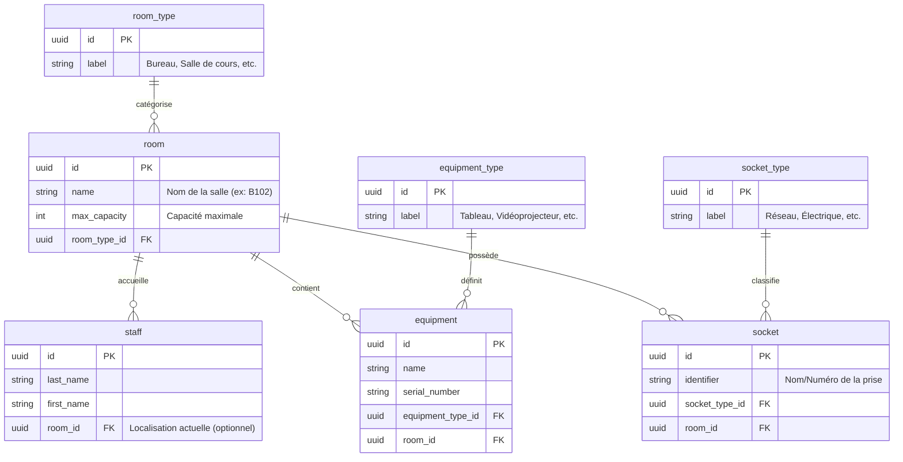

# Documentation : Base de Données - Gestion de Locaux

Ce document explique l'architecture et le fonctionnement de la base de données PostgreSQL utilisée pour le projet de gestion de salles de faculté.

## 1. Architecture Générale

La base de données est composée de **7 tables** interconnectées permettant de suivre l'occupation des salles par le personnel ainsi que l'inventaire du matériel et des prises disponibles.

### Schéma Relationnel (Mermaid)



## 2. Choix Techniques

### Identifiants UUID
Contrairement aux identifiants classiques (1, 2, 3...), nous utilisons des **UUID (Universally Unique Identifiers)**. 
- **Pourquoi ?** Ils permettent de fusionner des bases de données plus facilement à l'avenir et cachent la quantité réelle de données stockées pour plus de sécurité.
- **Mise en œuvre** : L'extension Postgres `uuid-ossp` génère ces clés automatiquement.

### PostgreSQL & Docker
La base tourne sous **PostgreSQL 15** dans un conteneur Docker. Cela garantit que le projet fonctionne exactement de la même manière sur Windows (via Docker Desktop) et sur Linux.

## 3. Guide d'Utilisation Docker

### Lancement
Pour démarrer la base de données :
```bash
docker compose up -d
```

### Arrêt
Pour arrêter les services :
```bash
docker compose stop
```

## 4. Informations de Connexion

Si vous souhaitez connecter une application ou un outil (comme DBeaver) :

| Paramètre | Valeur |
| :--- | :--- |
| **Hôte** | `localhost` |
| **Port** | `5432` |
| **Utilisateur** | `admin` |
| **Mot de passe** | `password123` |
| **Base de données**| `gestion_locaux` |

## 5. Persistence des Données
Les données sont stockées dans un **volume Docker** nommé `pgdata`. Cela signifie que même si vous supprimez le conteneur, vos salles et votre personnel ne seront pas supprimés. Ils sont sauvegardés dans un dossier sécurisé géré par Docker sur votre disque dur.

## 6. Initialisation
Le script [init.sql](./init.sql) est exécuté **uniquement lors de la toute première création** de la base de données. Il contient la structure des tables et quelques données de base pour démarrer le projet.
