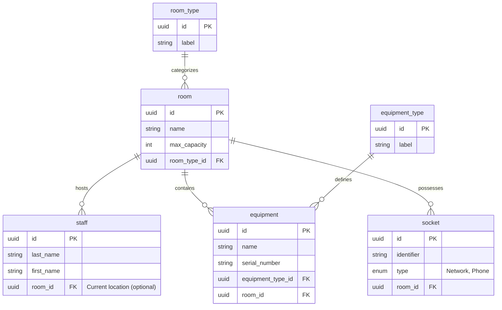

# Database Design: Room Management System

This document outlines the database structure for the application used to track staff and equipment within various rooms.

## UML Diagram (Mermaid)



## Table Descriptions

### 1. `room`
Represents a physical room or space.
- **id**: Unique identifier (UUID).
- **name**: Room name (e.g., "B102").
- **max_capacity**: Maximum number of allowed occupants.
- **room_type_id**: Foreign key to `room_type` (UUID).

### 2. `room_type`
Dictionary of room types.
- **id**: Unique identifier (UUID).
- **label**: (e.g., Office, Classroom, Break room, Meeting room).

### 3. `staff`
Represents employees or occupants.
- **id**: Unique identifier (UUID).
- **last_name**, **first_name**: Identity of the person.
- **room_id**: Room where the staff member is currently located (UUID). Can be `NULL` if not assigned.

### 4. `equipment`
Inventory of mobile or fixed equipment.
- **id**: Unique identifier (UUID).
- **name**: Descriptive name.
- **serial_number**: For precise tracking (optional).
- **equipment_type_id**: Foreign key to `equipment_type` (UUID).
- **room_id**: Room where the equipment is assigned (UUID).

### 5. `equipment_type`
Dictionary of equipment types.
- **id**: Unique identifier (UUID).
- **label**: (e.g., Whiteboard, Projector, Computer).

### 6. `socket`
Records fixed connections.
- **id**: Unique identifier (UUID).
- **identifier**: Socket name or number (e.g., "ETH-01").
- **type**: Type of socket (Network or Phone).
- **room_id**: Room where the socket is located (UUID).

## System Capabilities
- **Changing room type**: Simply update `room_type_id` in the `room` table.
- **Moving (Equipment/Staff)**: Update `room_id` in the respective tables.
- **Occupancy Management**: Count records in `staff` with a specific `room_id` and compare with `max_capacity` of the `room`.

## Export Diagram

To convert the Mermaid diagram into an image, you can use the Mermaid CLI (`mmdc`). Run the following command in your terminal:

```bash
npx -p @mermaid-js/mermaid-cli mmdc -i database_schema.md -o database_schema.png
```
